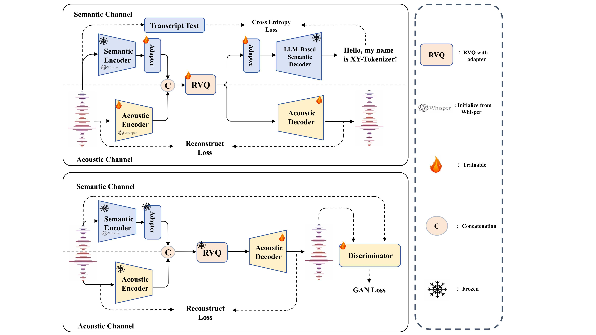

<div align="center">
    <h1>
    XY-Tokenizer: Mitigating the Semantic-Acoustic Conflict in Low-Bitrate Speech Codecs
    </h1>
    <p>
    <a href="???"></a>
    <a href="https://arxiv.org/pdf/2506.23325"></a>
    <a href="https://huggingface.co/fdugyt/XY_Tokenizer"></a>
    <a href="https://github.com/"></a>
    <a href="https://github.com/OpenMOSS/MOSS-TTSD"></a>
    <a href="https://github.com/OpenMOSS/MOSS-TTSD"></a>
    </p>
</div>


## Overview 🔍

**XY-Tokenizer** is a novel speech codec designed to bridge the gap between speech signals and large language models by simultaneously **modeling both semantic and acoustic information**. It operates at a bitrate of **1 kbps** (1000 bps), using **8-layer Residual Vector Quantization (RVQ8)** at a **12.5 Hz** frame rate.

At this ultra-low bitrate, **XY-Tokenizer** achieves performance comparable to state-of-the-art speech codecs that focus on only one aspect—either semantic or acoustic—while **XY-Tokenizer** performs strongly on both. For detailed information about the model and demos, please refer to our [Blog](???). You can also find the model on [Hugging Face](https://huggingface.co/fdugyt/XY_Tokenizer).

## Highlights ✨

- **Low frame rate, low bitrate with high fidelity and text alignment**: Achieves strong semantic alignment and acoustic quality at 12.5Hz and 1kbps.

- **Multilingual training on the full Emilia dataset**: Trained on a large-scale multilingual dataset, supporting robust performance across diverse languages.

- **Designed for Speech LLMs**: Can be used for zero-shot TTS, dialogue TTS (e.g., [MOSS-TTSD](https://github.com/OpenMOSS/MOSS-TTSD)), and speech large language models.

<div align="center">
    <p>
    
    </p>
</div>


## News 📢

- **[2025-06-28]** We released the code and checkpoints of XY-Tokenizer. Check out our [paper](???) and [demo](???)!     

## Installation 🛠️

To use XY-Tokenizer, you need to install the required dependencies. You can use either pip or conda to set up your environment.

### Using conda

```bash
# Clone repository
git clone git@github.com:gyt1145028706/XY-Tokenizer.git && cd XY_Tokenizer

# Create and activate conda environment
conda create -n xy_tokenizer python=3.10 -y && conda activate xy_tokenizer

# Install dependencies
pip install -r requirements.txt
```

## Available Models 🗂️

| Model Name | Hugging Face | Training Data |
|:----------:|:-------------:|:---------------:|
| XY-Tokenizer | [🤗](https://huggingface.co/fdugyt/XY_Tokenizer) | Emilia |
| XY-Tokenizer-TTSD-V0 (used in [MOSS-TTSD](https://github.com/OpenMOSS/MOSS-TTSD)) | [🤗](https://huggingface.co/fnlp/XY_Tokenizer_TTSD_V0/) | Emilia + Internal Data (containing general audio) |

## Usage 🚀

### Download XY Tokenize

You need to download the XY Tokenizer model weights. You can find the weights in the [XY_Tokenizer Huggingf Face repository](https://huggingface.co/fdugyt/XY_Tokenizer).

```bash
mkdir -p XY_Tokenizer/weights && huggingface-cli download fdugyt/XY_Tokenizer xy_tokenizer.ckpt --local-dir ./weights/
```

### Local Inference

First, set the Python path to include this repository:
```bash
export PYTHONPATH=$PYTHONPATH:./
```

Then you can tokenize audio to speech tokens and generate reconstructed audio from these tokens by running:
```python
python inference.py 
```

The reconstructed audio files will be available in the `output_wavs/` directory.

## Demos 🎮

See our blog for more demos at [Blog](???)

## License 📜

XY-Tokenizer is released under the Apache 2.0 license.

## Citation 📚

```
@misc{gong2025xytokenizermitigatingsemanticacousticconflict,
      title={XY-Tokenizer: Mitigating the Semantic-Acoustic Conflict in Low-Bitrate Speech Codecs}, 
      author={Yitian Gong and Luozhijie Jin and Ruifan Deng and Dong Zhang and Xin Zhang and Qinyuan Cheng and Zhaoye Fei and Shimin Li and Xipeng Qiu},
      year={2025},
      eprint={2506.23325},
      archivePrefix={arXiv},
      primaryClass={cs.SD},
      url={https://arxiv.org/abs/2506.23325}, 
}
```
